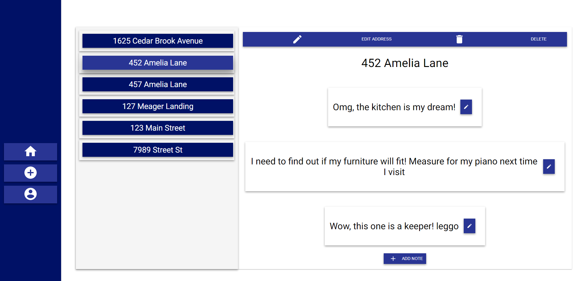
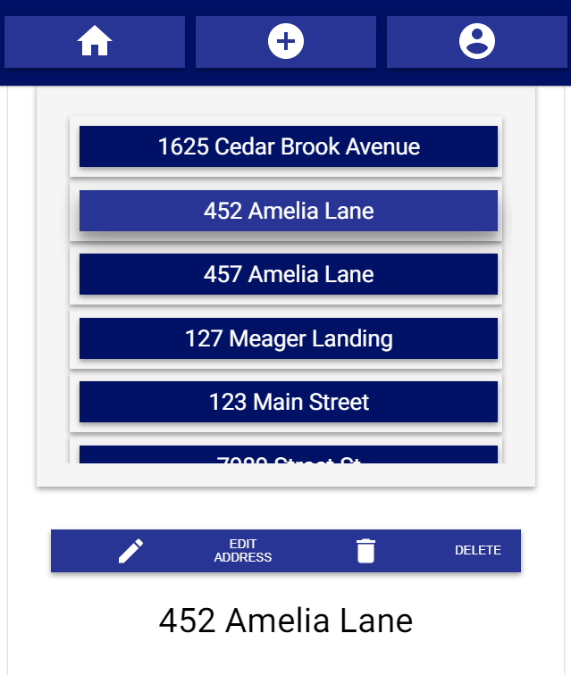

# Homebl

Simple create, read, update, and delete utility application for homeshoppers

## Live Application

---

### [Homebl](https://homebl-client.vercel.app/)

--- Vercel App

## The Problem

---

As a homebuyer, you search countless websites, like Zillow, Redfin, etc., only to mismanage and lose a list of your favorite homes. You want a place to store all your favorite homes that you lose in this process. You want to be able to save a simple note, with the address and other useful information. You want to be able to save this list to edit and delete as needed.

## The Solution

---

`Homebl` is a very lightweight, simple solution for saving home addresses and notes in one central place. It will allow the user to save her favorite homes, update, and delete them in a personalized account.

> A great solution for realtors adding value to their customers

## Summary

---

`Homebl` is a react powered, mobile-friendly web application that uses a deployed PostgreSQL powered database, Node.js & Express powered server.

### Capstone

This is a capstone for Thinkful's 'Software Engineering Immersion' program. This is also my FIRST solo full-stack application! The project was completed within a 10 day working day period, not including a week for planning (wireframing, brainstorming, kanban board prep, etc.), therefore the `MVP` version is limited to simple `CRUD` utilities and features a very simple UI. Thinkful's program does not cover basic or advanced use of React Hooks nor was there an emphasis on design. I loved using hooks, as it made state management much easier to compartmentalize. I also appreciate the flexibility and imagination they give a JavaScript developer. I have plans for expansion that is listed below under 'Coming Features'.

---

#### Preview Images




### Features

---

- Login and Register
- Logout persists user stored data
- Add an address - Simple format for: mailing address, city, state, zip code
- Add a note for an address - Simple content, user specific
- Edit the fields for the address
- Edit the conent of the note
- Delete the address entirely
- Delete spcific address note(s)

### Technology

---

- Hooks
  - `react@latest` & `react-dom@latest`
  - customHooks!
  - all components are using state from custom hooks
  - example ...

  ```javascript
      const useGetAddress = ({match}) => {
      const [address, setAddress] = useState({})
      const [addressError, setError] = useState(null)
      const { addressId } = match.params
      useEffect(() => {
        let mounted = true
        const getAddress = async () => {
          try {
            const response = await fetch(
              `${.../address/${addressId}`,...)
            const data = await response.json()
            if (data.error) throw data.error

            mounted && setAddress(data)
          } catch (error) {
            setError(error)
          }
        }
        getAddress()
        return () => (mounted = false)
      }, [addressId])
      return { address, addressError }
    }

- User Authentication
  - fetching and storing `jwt` authorization token from the databse, which encrypts user passwords using `bcrypt`

  ```javascript
  function saveAuthToken(token) {
    window.localStorage.setItem(token_key, token)
  }

- Conditional Rendering
  - use state variables to render components
  - user is redirected based on token truthiness

  ```javascript
  <Route
    exact
    path='/'
    render={() =>
      !isLogged ? (
        <Redirect to={'/login'} />
      ) : (
        <Redirect to={'/address'} />
      )
    }
  />

- React Context Api

  ```javascript
    const LoggedInContext = createContext({
    isLogged: false,
    setIsLogged: () => {},
    })

- Express.js powered API backend --- [Server GitHub Repository](https://github.com/themlp101/homebl-server)
  - server supports `/GET /POST /DELETE /PATCH` HTTP requests
  - `bcrypt` password encryption and `jwt` for front-end verification
  - uses `CORS` (Cross-origin resource sharing) standards
  - uses `Helmet` for protected HTTP request headers
  - database migration with `postgrator-cli`
  - utilizes `morgan` as logger middleware
  - database queried using `knex` library
  - deployed using `heroku`

### Coming Features

---

- Search notes or addresses!
- Save to a condensed favorites list!
- Add notable features (the user will select from a list of features homeshoppers consider pros or cons) - `Homebl Tour` --- Google Maps API powered navigation
